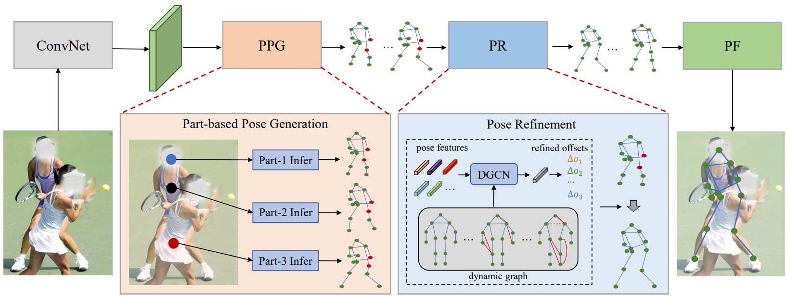
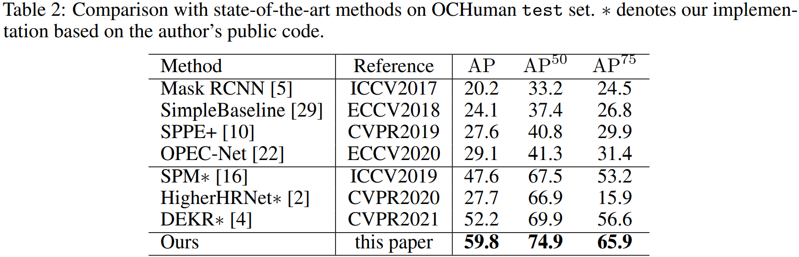
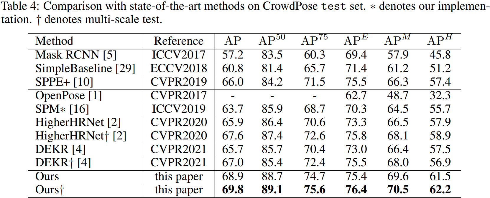

  

# PINet

Pytorch implementation of paper ["Robust Pose Estimation in Crowded Scenes with Direct Pose-Level Inference"](https://papers.nips.cc/paper/2021/hash/31857b449c407203749ae32dd0e7d64a-Abstract.html) (NeurIPS 2021). 



## Installation

### 1. Clone code
```shell
    git clone https://github.com/kennethwdk/PINet
    cd ./PINet
```

### 2. Install dependency python packages
```shell
    conda create --name PINet --file requirements.txt
```

### 3. Prepare dataset
Download [OCHuman](https://github.com/liruilong940607/OCHumanApi), [CrowdPose](https://github.com/Jeff-sjtu/CrowdPose) and [COCO ](https://cocodataset.org/#home) from website and put the zip file under the directory following below structure, (xxx.json) denotes their original name.

```
./data
├── ochuman
│   └── annotations
|   |   └──ochuman_val.json(ochuman_coco_format_val_range_0.00_1.00.json)
|   |   └──ochuman_test.json(ochuman_coco_format_test_range_0.00_1.00.json)
|   └── images
|   |   └──xxxx.jpg
├── crowdpose
│   └── annotations
|   |   └──crowdpose_trainval.json(refer to DEKR, link:https://github.com/HRNet/DEKR)
|   |   └──crowdpose_test.json
|   └── images
|   |   └──xxxx.jpg
|── coco
│   └── annotations
|   |   └──coco_train.json(person_keypoints_train2017.json)
|   |   └──coco_val.json(person_keypoints_val2017.json)
|   |   └──coco_test.json(image_info_test-dev2017.json)
|   └── images
|   |   └──train2017
|   |   |   └──xxxx.jpg
|   |   └──val2017
|   |   |   └──xxxx.jpg
|   |   └──test2017
|   |   |   └──xxxx.jpg
```
## Usage

### 1. Download trained model
* [OCHuman](https://1drv.ms/u/s!AhpKYLhXKpH7gudZq_qysws2ZWhzZw?e=1LnCYk)
* [CrowdPose](https://1drv.ms/u/s!AhpKYLhXKpH7gudZq_qysws2ZWhzZw?e=1LnCYk)
* [COCO](https://1drv.ms/u/s!AhpKYLhXKpH7gudZq_qysws2ZWhzZw?e=1LnCYk)
* [ImageNet pre-trained](https://1drv.ms/u/s!AhpKYLhXKpH7gudZq_qysws2ZWhzZw?e=1LnCYk)

### 2. Evaluate Model
Change the checkpoint path by modifying `TEST.MODEL_FILE` option in *.yaml* or command line. 

`--gpus` option specifies the gpu ids for evaluation, multiple ids denotes multiple gpu evaluation.

```python
# evaluate on ochuman with 2 gpus
python tools/valid.py --cfg experiments/ochuman.yaml --gpus 0,1 TEST.MODEL_FILE model/ochuman/checkpoint.pth.tar

# evaluate on crowdpose with 2 gpus
python tools/valid.py --cfg experiments/crowdpose.yaml --gpus 0,1 TEST.MODEL_FILE model/crowdpose/checkpoint.pth.tar

# evaluate on coco with 2 gpus
python tools/valid.py --cfg experiments/coco.yaml --gpus 0,1 TEST.MODEL_FILE model/coco/checkpoint.pth.tar
```

### 3. Train Model

You need to download HRNet-W32 imagenet pretrained model (see above) and change the checkpoint path by modifying `MODEL.PRETRAINED` in .yaml, and run following commands:
```python
# train on ochuman with 2 gpus
python tools/train.py --cfg experiments/ochuman.yaml --gpus 0,1

# train on crowdpose with 2 gpus
python tools/train.py --cfg experiments/crowdpose.yaml --gpus 0,1

# train on coco with 2 gpus
python tools/train.py --cfg experiments/coco.yaml --gpus 0,1
```

The experimental results are obtained by training on two NVIDIA RTX 3090. You can use more gpu cards for model training by specifying gpu ids in `--gpus` optition, *e.g.*, training model on crowdpose on 8 gpu cards by
```python
# train on crowdpose with 8 gpus
python tools/train.py --cfg experiments/crowdpose.yaml --gpus 0,1,2,3,4,5,6,7
```

Note that you should modify corresponding batch size for each gpu by `TRAIN.IMAGES_PER_GPU`.

## Results

|Datasets | AP | AP50 | AP75 |
| :--------: | :-----: | :----: | :----: |
|OCHuman | 59.8 | 74.9 | 65.9 |
|CrowdPose | 68.9 | 88.7 | 74.7 |
|COCO (val set) | 67.3 | 86.8 | 74.0 |





## Citations
If you find this code useful for your research, please cite our paper:

```
@inproceedings{wang2021robust,
  title={Robust Pose Estimation in Crowded Scenes with Direct Pose-Level Inference},
  author={Wang, Dongkai and Zhang, Shiliang and Hua, Gang},
  booktitle={Thirty-Fifth Conference on Neural Information Processing Systems},
  year={2021}
}
```
## Contact me
If you have any questions about this code or paper, feel free to contact me at
dongkai.wang@pku.edu.cn.

## Acknowledgement
The code is mainly encouraged by [HigherHRNet](https://github.com/HRNet/HigherHRNet-Human-Pose-Estimation) and [DEKR](https://github.com/HRNet/DEKR).
